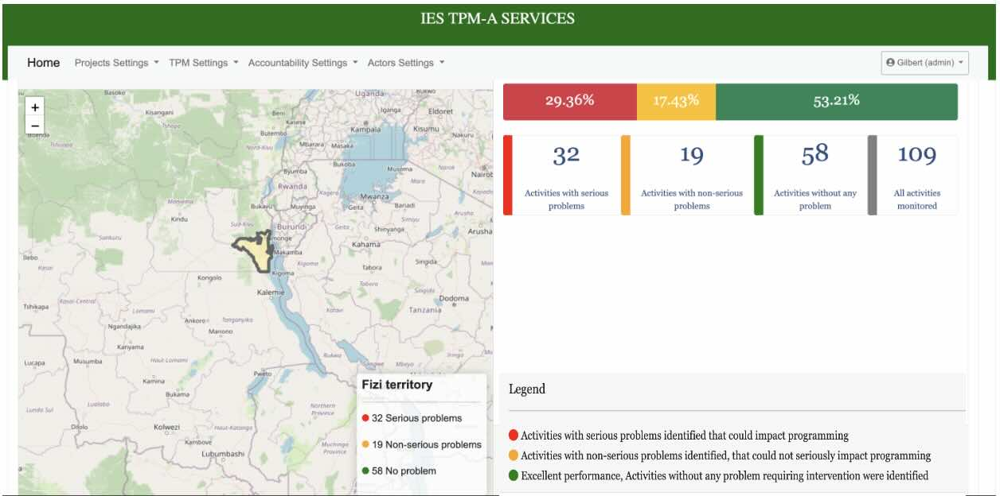
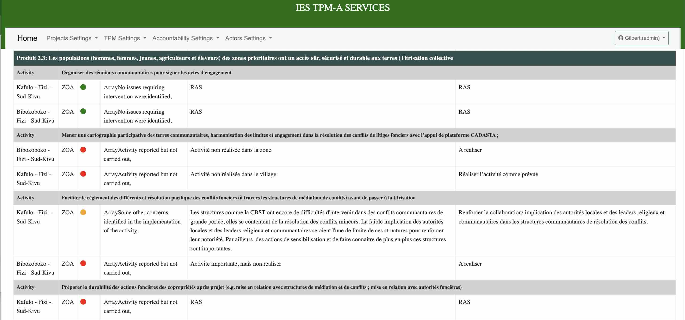

# RT-MEAL: Real-Time Monitoring, Evaluation, Accountability, and Learning 📊

**RT-MEAL** is a professional web-based solution designed to streamline **Complaint Feedback Mechanisms (CFM)** and **Third-Party Monitoring (TPM)** for humanitarian and development projects. 

[cite_start]Developed during my tenure at **IES Congo** [cite: 48, 54][cite_start], this platform ensures transparency and real-time data integration in complex environments, specifically supporting Monitoring, Evaluation, Accountability, and Learning (MEAL)[cite: 54].

🚀 **Live Demo:** [rtmeal.iescongo.com](https://rtmeal.iescongo.com)

---

### 🖼️ Interface Preview

| Dashboard Overview | Data Analytics |
| :---: | :---: | 
|  |  |

---

### 🌟 Key Features

* [cite_start]**Complaint Management:** Digitalized workflow for receiving, processing, and resolving community feedback[cite: 54].
* [cite_start]**Third-Party Monitoring (TPM):** Tools for independent verification of project activities and outputs[cite: 25, 54].
* [cite_start]**Real-Time Dashboards:** Instant visualization of KPIs to support data-driven decision-making[cite: 53, 54].
* [cite_start]**Modular Architecture:** Scalable MVC structure to fit various humanitarian project requirements[cite: 54].

### 🛠 Technical Stack

Built with a focus on reliability and performance using the **MVC (Model-View-Controller)** pattern:

* [cite_start]**Backend:** PHP (Modular Architecture) [cite: 115]
* [cite_start]**Database:** MySQL [cite: 116]
* [cite_start]**Frontend:** Bootstrap (Responsive Design), JavaScript [cite: 115]
* [cite_start]**Frameworks/Tools:** Expertly integrated for field-to-office data synchronization[cite: 10, 11].

---

### ⚖️ License & Copyright

**Copyright (c) 2022 Gilbert Amisi Lumona & IES Congo.**

This project is licensed under the **MIT License**. 

> Permission is hereby granted, free of charge, to any person obtaining a copy of this software and associated documentation files to deal in the Software without restriction, including without limitation the rights to use, copy, modify, merge, publish, distribute, sublicense, and/or sell copies of the Software, provided that the above copyright notice and this permission notice shall be included in all copies or substantial portions of the Software.

---

### 👤 Contact & References
[cite_start]**Gilbert Amisi Lumona** [cite: 3]
* [cite_start]**Role:** Software Developer & Data Professional [cite: 4, 9]
* [cite_start]**LinkedIn:** [Gilbert Amisi Lumona](https://www.linkedin.com/in/gilbert-amisi-lumona) [cite: 7]
